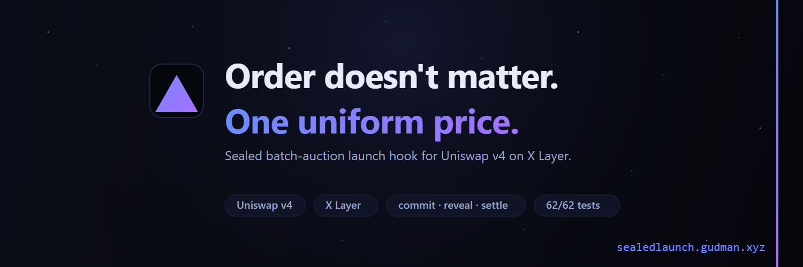
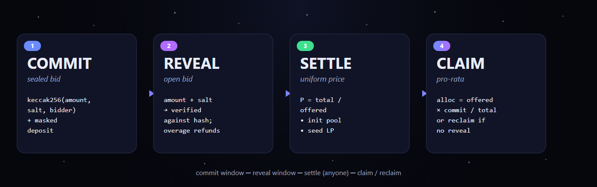
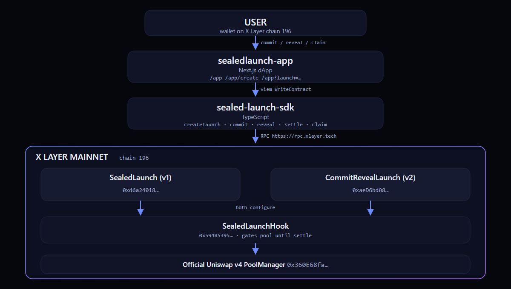

<p align="center"></p>

<h1 align="center">Sealed Launch</h1>
<p align="center"><em>A sealed batch-auction launch hook for Uniswap v4 on X Layer.</em></p>
<p align="center">
  <a href="https://www.oklink.com/xlayer/address/0xaeD6bd08CDBaD833312d6BCFd9F97954350F606e"></a>
  <a href="#tests"></a>
  <a href="https://www.oklink.com/xlayer/address/0x360E68faCcca8cA495c1B759Fd9EEe466db9FB32"></a>
  <a href="https://x.com/sealedlaunch"></a>
  <a href="https://opensource.org/licenses/MIT"></a>
</p>

<p align="center">
  <a href="https://sealedlaunch.gudman.xyz/"><b>↗ Live site</b></a> ·
  <a href="https://sealedlaunch.gudman.xyz/app"><b>↗ Open the dApp</b></a> ·
  <a href="https://sealedlaunch.gudman.xyz/app/create"><b>↗ Create a launch</b></a>
</p>

> **Order doesn't matter. One uniform price.** Token launches that aren't snipeable — because there is no front.

## TL;DR

- **What:** an order-independent, uniform-price sealed batch-auction launch hook for **Uniswap v4**. Two managers (v1 `SealedLaunch`, v2 `CommitRevealLaunch`) share one gating hook.
- **Where:** live on **X Layer mainnet (chain 196)** against the official v4 PoolManager, with a real multi-bidder lifecycle settled end-to-end on-chain.
- **How:** bids are sealed during the window, everyone clears at one uniform price, allocation is pro-rata to what each bidder revealed.
- **Why:** on a flashblocks sequencer where block-level ordering is unpredictable, a sealed batch is the only launch design that's provably un-snipeable.

## The problem

Token launches get sniped. Whoever orders the trade first walks away with the cheap supply; retail eats the markup. Every existing defense — fee decay, Dutch auctions, fixed-price windows, priority-fee MEV taxes — still rewards whoever orders first or pays the most to be ordered first.

In December 2025 X Layer migrated to the OP Stack and runs a **flashblocks** sequencer. We tested real mainnet blocks: transactions are not ordered by priority fee, and block-level ordering is effectively unpredictable. On a chain where you can't predict ordering, the only un-snipeable launch is one where ordering is irrelevant — a sealed uniform-price batch auction.

## How it works

Four phases. One price. Everyone clears the same.

1. **Commit.** Bidders post a hashed commitment `keccak256(amount, salt, bidder)` and escrow a masked deposit (an upper bound on the real bid). The pool is gated by `SealedLaunchHook`; nobody can trade the token.
2. **Reveal.** Bidders open their bid by submitting the real `amount + salt`. The overage is refunded atomically. Bid sizes appear on-chain only here.
3. **Settle.** Anyone calls `settle()`. The auction clears at one uniform price, the pool is initialized at that price, full-range LP is seeded via `poolManager.unlock → modifyLiquidity`, and trading opens. If `totalRevealed < minRaise`, the launch fails and every committer can reclaim.
4. **Claim.** Each revealer claims their pro-rata token allocation. Non-revealers reclaim their masked deposit.

```
clearingPrice P = totalRevealed / offeredTokens
allocation(b) = offeredTokens * revealed(b) / totalRevealed
```

Fairness is a property of the mechanism, not a tunable parameter.

<p align="center"></p>

## v1 vs v2

Two managers, one shared gating hook.

| | v1 — SealedLaunch | v2 — CommitRevealLaunch |
|---|---|---|
| Order-independent | yes | yes |
| Bid sizes sealed on-chain | no | yes (hashed commit + masked deposit) |
| Settlement | uniform price, pro-rata | uniform price, pro-rata |
| Mechanism | direct commit | hashed commit + reveal |
| Deployed on X Layer mainnet | yes | yes |

v2 supersedes v1 for new launches. v1 stays live as historical proof of the first end-to-end mainnet settlement. v2 has a documented "free-option" trade-off (a committer can skip reveal if the clearing price turns unfavorable); bond-burn hardening is a future iteration.

## Architecture

`SealedLaunchHook` is a pure access-control gate — it reverts every swap until `markSettled` is called, blocks non-manager liquidity adds pre-settlement, holds no funds, and runs no price math. The two managers (`SealedLaunch` v1 and `CommitRevealLaunch` v2) handle escrow, clearing, and LP seeding via `IUnlockCallback`. The hook address is CREATE2-mined (`HookMiner`) so its low bits carry the v4 permission flags `beforeInitialize | beforeAddLiquidity | beforeSwap` (`0x2880`). Gas is paid in OKB.

<p align="center"></p>

## Live on X Layer mainnet (chain 196)

| Contract | Address | OKLink |
|---|---|---|
| v2 CommitRevealLaunch (manager) | `0xaeD6bd08CDBaD833312d6BCFd9F97954350F606e` | [view](https://www.oklink.com/xlayer/address/0xaeD6bd08CDBaD833312d6BCFd9F97954350F606e) |
| v1 SealedLaunch (manager) | `0xd6a240183eea10cd74f9911FE3f7717c90564B8C` | [view](https://www.oklink.com/xlayer/address/0xd6a240183eea10cd74f9911FE3f7717c90564B8C) |
| SealedLaunchHook (shared) | `0x594B539591e51e7981b05126B7e4d869C3BaA880` | [view](https://www.oklink.com/xlayer/address/0x594B539591e51e7981b05126B7e4d869C3BaA880) |
| Uniswap v4 PoolManager (official) | `0x360E68faCcca8cA495c1B759Fd9EEe466db9FB32` | [view](https://www.oklink.com/xlayer/address/0x360E68faCcca8cA495c1B759Fd9EEe466db9FB32) |

The v2 demo ran end-to-end on mainnet with two distinct on-chain bidders: bidder A (`0x53Dd6dF0F92c9d5f4275827B9D1aecb79619E793`) and bidder B (`0xDAf2e49A5085a302AFE6F0F009EE821481f28C38`) posted asymmetric sealed bids — masked **1000 + 500 dUSD2** — then revealed real amounts of **700 + 300 dUSD2** with the overage refunded atomically, the auction cleared at one uniform price, both bidders claimed pro-rata allocations (**280,000 + 120,000 SBID = 7:3**), and a post-settlement swap traded the now-open pool. Demo poolId: `0x33bd0be4…686cca`. Full tx provenance lives in `broadcast/DeployCommitRevealDemo.s.sol/196/`, `broadcast/RevealCommitRevealDemo.s.sol/196/`, and `broadcast/SettleCommitRevealDemo.s.sol/196/`.

## Try it

- **Drive the live demo:** open the [lifecycle viewer](https://sealedlaunch.gudman.xyz/app) — it defaults to the mainnet demo and walks through commit / reveal / settle / claim from one URL.
- **Spin up your own launch:** [/app/create](https://sealedlaunch.gudman.xyz/app/create) deploys a fresh ERC-20 and opens a v2 CommitRevealLaunch pool in a single transaction with your own window, raise, and tick spacing.
- **Deep-link any deployment:** `https://sealedlaunch.gudman.xyz/app?launch=<manager>&poolId=<id>`. Only audited managers are trusted; unknown ones go read-only behind an explicit opt-in.

## Documentation

- [`sdk/README.md`](sdk/README.md) — `sealed-launch-sdk` v0.1: viem-native TypeScript SDK with full v2 read+write surface and thin v1 wrappers.
- [`app/README.md`](app/README.md) — `sealed-launch-app`: Next.js 15 + React 19 + wagmi 2 reference dApp consuming the SDK via `file:../sdk`.
- [`docs/DESIGN-phase3-5.md`](docs/DESIGN-phase3-5.md) — contract-level design for Phases 3–5.
- [`docs/ERC-launch-covenants.md`](docs/ERC-launch-covenants.md) — draft EIP for on-chain launch covenants.
- [`ROADMAP.md`](ROADMAP.md) — phase plan from hackathon hook to fair-issuance rail.

## Quickstart for developers

Run the contract test suite:

```bash
forge test
```

Build the SDK first — the app consumes it via `file:../sdk`:

```bash
cd sdk && npm install && npm run build
```

Then run the dApp:

```bash
cd app && npm install && npm run dev
```

Mainnet scripts assert `block.chainid == 196`; testnet scripts assert `1952`. The hook address is CREATE2-mined via `HookMiner`.

## Internal security audit (2026-05-28) — disclosed findings

Pre-submission disclosure of every issue surfaced by the internal audit, with patch status per stream.

A full internal audit covering contracts, SDK, frontend and Foundry scripts was run on the day of the submission. **61 findings** across the four streams. The frontend, SDK and scripts findings are **patched in this commit** (see the commit log). The contract findings are deferred to a v1.1 / v2.1 redeploy because the live mainnet addresses cannot be patched in place — the deployed contracts are documented as known-limited v1.0. Contract source carries the v1.1 patches plus **10 new tests** covering them, but the **deployed v1.0 addresses are unchanged**.

| Stream | Findings | Status |
|---|---|---|
| Frontend | covered in 61 total | patched in this commit |
| SDK | covered in 61 total | patched in this commit |
| Foundry scripts | covered in 61 total | patched in this commit |
| Contracts | 2 CRITICAL + High/Medium | source-patched + 10 new tests; **live v1.0 addresses unchanged** |

**Critical findings on the LIVE mainnet contracts (do NOT use for multi-launch production):**

- **C-1 — `SealedLaunch.settle()` balance-sweep.** `src/SealedLaunch.sol:212-213` uses `quote.balanceOf(address(this))` to compute the launcher payout. If a second launch (legitimate or attacker-created) coexists on the same manager with the same quote token, settling either one drains the other's escrow to the settling launcher. Mitigated today by the manager hosting only the demo auction. **Do not host multiple concurrent launches on a single SealedLaunch v1 manager.**
- **C-2 — `CommitRevealLaunch` LP can over-consume the shared balance.** `src/CommitRevealLaunch.sol` doesn't `require(quoteUsed <= totalRevealed)` after the `unlock` callback, doesn't bound `tickSpacing` / `_sqrtPriceX96`, and shares its quote balance with other launches on the same manager. A pathological launch can pull more quote during LP seeding than it raised, drawing from non-revealer escrow or sibling launches. Mitigated today by the manager hosting only the demo auction.

**High-severity findings (also deferred to v1.1):**

- **H-3 — `settle()` brick on launcher-chosen inputs.** Bad `tickSpacing` / `minRaise=0` with zero reveals / extreme price math can revert `settle()` permanently, locking every committer out of reclaim. v1.1 must add a `failed` fallback when the math is out of bounds.
- **H-4 — `_activeKey` / `_activeId` reentrancy via ERC-777-style quote tokens.** Add `nonReentrant` modifiers on every external state-changing function.
- **H-5 — Same shared-balance class as C-2** for the launcher payout path in v2.
- **H-6 — Defense-in-depth `nonReentrant`** missing on the contract.
- **M-9 — `SealedLaunchHook.configure` is unrestricted** — front-runnable, can deny a legitimate launch by pre-configuring a pool id with a different manager.

**v1.1 / v2.1 fix plan (post-submission):**

1. Replace balance-sweep with per-launch quote accounting (`launcherProceeds = l.totalRevealed - quoteUsed`, already correct in v2 except for the missing bound on `quoteUsed`).
2. Add `require(quoteUsed <= l.totalRevealed)` and `tickSpacing` / sqrtPrice bounds validation.
3. Add `nonReentrant` on every external state-changing function.
4. Restrict `SealedLaunchHook.configure` to an allowlist of trusted managers.
5. New tests covering the cross-launch drain scenario (10 added — `forge test` is 72/72).
6. Redeploy to fresh mainnet addresses. The v1.0 demo addresses stay on-chain as historical proof.

**Frontend / SDK / scripts findings — patched in this commit:**

- Frontend: phishing-link allowlist (`KNOWN_LAUNCHES`) for `?launch=` query-param + opt-in ack; ActionPanel goes read-only on untrusted; `QuoteFaucet` chain-id gate + amount cap + cooldown; `ensureXLayerNetwork` uses the connected wallet's provider (not `window.ethereum`); Rabby-runbook only fires for actual Rabby; all action buttons disabled while pending; multi-tab race blocked via pre-commit `fetchBid`; `oklink` hrefs validated; `/create` ERC-20 sanity-call + strict input validation.
- SDK: `resolveChain(ctx)` throws if `WalletClient` has no chain (fixes wrong-chain broadcast); `createLaunch` result now includes the decoded `PoolKey`; `LP_FEE` ABI mutability corrected `view` → `pure`; `deriveSalt` normalizes to NFC; new `hasCommitted(b)` helper; unsafe `as` casts removed in reads; peer dep `viem ^2.21.0`.
- Foundry scripts: `require(block.chainid == 196)` on every mainnet script (closes the cross-chain footgun from the shared v4 PoolManager address on X Layer + Arbitrum); `require(== 1952)` on the testnet script; `DeployLiftoff.s.sol` standardized to envUint + keyed broadcast; `DEMO_TICK_SPACING` constant; `SKIP_DEMO_SWAP` env gate.

## Roadmap

- **Phase 0 — Built** ✅ — v4 hook + v1/v2 managers, 72/72 Foundry tests, real auction settled on X Layer mainnet.
- **Phase 1 — Win the hackathon** ✅ — deployed to mainnet, multi-bidder lifecycle settled on-chain, live state widget, demo video + submission.
- **Phase 2 — Hook → product** — commit-reveal v2 shipped; SDK v0.1 + hosted dApp v0.1 shipped in-tree; next: auction variants, OKB fee routing, third-party audit before real TVL.
- **Phase 3 — X Layer launch standard** — flap partnership as v4-native fair-launch mode; launchpad-as-a-service; fairness reputation; OKX OnchainOS skill + OKB-denominated fees.
- **Phase 4 — Smarter auctions + multi-chain** — tiered / Dutch curves, allowlist/KYC gates, NFT vesting, anti-dump covenants; deploy on every chain with official v4 (Base, Arbitrum, Unichain, Ink, …).
- **Phase 5 — Moonshot** — the fair-issuance rail for token markets; open standard other launchpads adopt; potentially an EIP for on-chain launch covenants.

## Tests

`forge test` runs **72/72** passing (61 prior + 1 live X Layer mainnet fork + 10 new v1.1 audit tests). The headline test, `test_sniperFirstBlockSamePricePerTokenAsLastBlock`, proves a first-block "sniper" and a last-block buyer receive identical allocation and identical price per token. The live mainnet fork test verifies the hook + manager wire-up against the real X Layer v4 PoolManager at the live block. The 10 new audit tests cover the v1.1 invariants (per-launch quote accounting, `quoteUsed <= totalRevealed`, manager allowlist, reentrancy guards, bounds checks).

## Built for

OKX **Build X — Hook the Future** hackathon. Uniswap v4 · X Layer · flap.sh. Tags: [@XLayerOfficial](https://x.com/XLayerOfficial) · [@Uniswap](https://x.com/Uniswap) · [@flapdotsh](https://x.com/flapdotsh).

## License

[MIT](LICENSE).

---

<p align="center">
  <br/>
  <a href="https://x.com/sealedlaunch">@sealedlaunch</a> · <a href="https://github.com/Ridwannurudeen/sealedlaunch">github.com/Ridwannurudeen/sealedlaunch</a>
</p>
